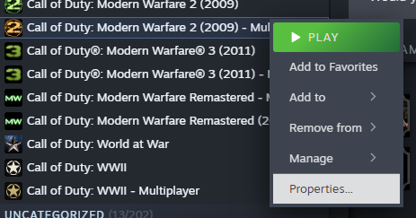
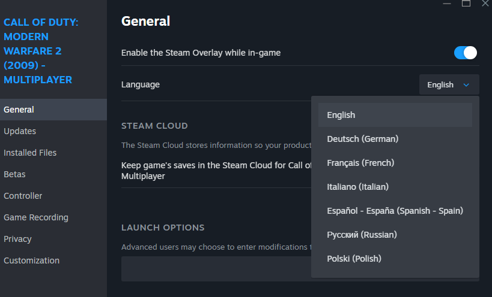
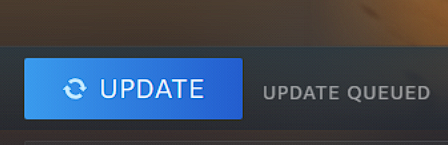

## Steam

Open steam and head to your library, find Call of Duty: Modern Warfare 2 (2009).
Right click on the name and open properties.

Once in properties look for language e.g `English`, click the drop down to select a different language.

Once you've changed your language you will need to update your game to download the new language

## Different Game directory

If your iw4x is in a different location you will need to move the language files to that directory.

Go to your steam Call of Duty Modern Warfare 2 folder then main, there you will need to copy over the video folder and all the localized_language_xx.iwds, copy these to the same directory as the steam folder e.g `mw2 iw4x client game/main`

Do this again but with the zone files, copy the zone folder of the language you picked e.g `german`.

And lastly you will need to copy over the new `localization.txt` for that languages