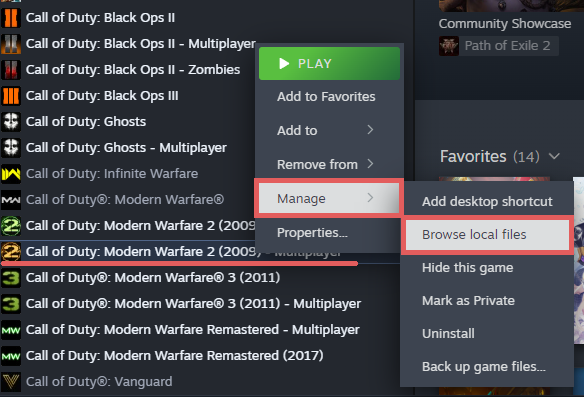
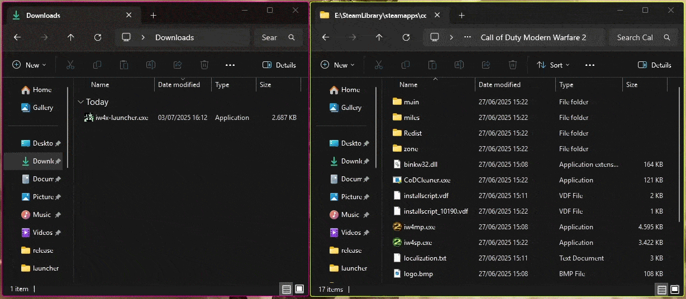

import { LinkButton } from '@astrojs/starlight/components';
import { FileTree } from '@astrojs/starlight/components';

## Prerequisites
Before installing IW4x, you need to obtain a legitimate copy of Call of Duty: Modern Warfare 2 (2009) [__from Steam__](https://store.steampowered.com/app/10180/Call_of_Duty_Modern_Warfare_2_2009/).

:::caution[Only Steam is supported]
IW4x does not support game copies from the Microsoft Store!
:::

## Launcher installation
The recommended way to install IW4x, with automatic updates included!

#### 1. Download [Call of Duty: Modern Warfare 2 (2009)](https://store.steampowered.com/app/10180/Call_of_Duty_Modern_Warfare_2_2009/)
Find Call of Duty: Modern Warfare 2 (2009) and Call of Duty: Modern Warfare 2 (2009) - Multiplayer in your Steam library, click each and select `Install`. Wait for the downloads to finish before you continue!

#### 2. Download the IW4x Launcher

  <LinkButton
    href="https://github.com/iw4x/launcher/releases/latest/download/iw4x-launcher.exe"
    variant="primary"
    icon="download"
    iconPlacement="start"
  >
    Windows 8.1/10/11
  </LinkButton>

  <LinkButton
    href="https://github.com/iw4x/launcher/releases/latest/download/iw4x-launcher-x86_64-unknown-linux-gnu.tar.gz"
    variant="secondary"
    icon="download"
    iconPlacement="start"
  >
    Linux
  </LinkButton>

#### 3. Locate your Game folder
Your game folder is located in your SteamLibrary, you can find it through Steam by selecting Call of Duty: Modern Warfare 2 (2009) in your library, right-clicking it and selecting Manage -> Browse local files.

#### 4. Move the IW4x Launcher to your Game folder
Grab the iw4x-launcher.exe from your Downloads and move it to your Game folder.

#### 5. Run the IW4x Launcher
Double-click the Launcher in your Game folder, a Console window will pop up and show you progress of the Installation. Once it's finished the game will start automatically.

Always use the iw4x-launcher.exe or the IW4x Desktop shortcut to start IW4x and automatically receive updates!

---

Having issues with the installation process? Join our [Discord server](https://discord.com/invite/pV2qJscTXf) for help!

---

## Manual installation

If you run into issues with the IW4x Launcher or use an older Windows version you can manually install IW4x.

You __don't__ have to do this if you followed the Launcher installation instructions above!

:::caution
You will not receive updates when installing IW4x manually!
:::

#### 1. Download [Call of Duty: Modern Warfare 2 (2009)](https://store.steampowered.com/app/10180/Call_of_Duty_Modern_Warfare_2_2009/)
Find Call of Duty: Modern Warfare 2 (2009) and Call of Duty: Modern Warfare 2 (2009) - Multiplayer in your Steam library, click each and select `Install`. Wait for the downloads to finish before you continue!

#### 2. Download the IW4x Client __and__ Rawfiles

  <LinkButton
    href="https://github.com/iw4x/iw4x-client/releases/latest/download/iw4x.dll"
    variant="primary"
    icon="download"
    iconPlacement="start"
  >
    Client
  </LinkButton>

  <LinkButton
    href="https://github.com/iw4x/iw4x-rawfiles/releases/latest/download/release.zip"
    variant="primary"
    icon="download"
    iconPlacement="start"
  >
    Rawfiles
  </LinkButton>

#### 3. Locate your Game folder
Your game folder is located in your SteamLibrary, you can find it through Steam by selecting Call of Duty: Modern Warfare 2 (2009) in your library, right-clicking it and selecting Manage -> Browse local files.

#### 4. Manually install IW4x

Move the downloaded `iw4x.dll` into the game folder.  
Extract the contents of `release.zip` into the game folder.

Your folder should look similiar to this:
<FileTree>
- iw4x/
- main/
- miles/
- userraw/
- zone/
- binkw32.dll
- iw4mp.exe
- iw4sp.exe
- iw4x.dll
- iw4x.exe
- mss32.dll
- zonebuilder.exe
</FileTree>

#### 5. Run `iw4x.exe`
Double-click `iw4x.exe` to start the game!

---

Having issues with the installation process? Join our [Discord server](https://discord.com/invite/pV2qJscTXf) for help!

