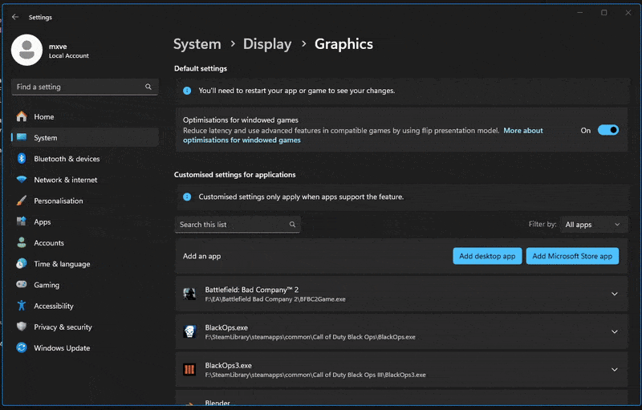

## Why is performance so bad?

There are many reasons your framerate can be low or for the game to feel unsmooth.  
Aside from your hardware not being able to render the game faster, many of these issues are cause by the game simply being old and newer graphics drivers/cards not supporting it as well.  
We'll list some tricks you can try to make the game look & feel better below.

### Graphics settings

The obvious one, if your graphics card isn't exactly a power house, try turning some of the Advanced Video settings down/off.

### Windows graphics settings

Adding `iw4x.exe` to the Windows "Graphics settings" and changing the GPU preference to High Performance makes sure Windows handles the game correctly.

### Window mode, FPS locking, VSync, Direct3D 9 Ex

You can try various combinations for the ingame settings, if you can live with a tiny bit of input latency enabling VSync can make the game feel smoother (just make sure to set your window mode to fullscreen).  
Changing your maximum FPS to a value your PC reaches can help too, if the settings menu isn't fine-grained enough you can change your max fps using the `com_maxfps` command, see the [Console Guide](/guides/console/) for more details.  
Higher FPS values are known the make the game behave differently as parts of it are tied to the framerate. We suggest not to go above 333 FPS.

### Disabling fullscreen optimization

Find your `iw4x.exe` in the game folder (next to the launcher), Right-click it, select Properties. At the top switch to the Compatibility tab, here you check the "Disable fullscreen optimizations" checkbox and click apply.

### DXVK (DirectX to Vulkan)

DXVK is a translation layer that implements multiple Direct3D versions in Vulkan. These implementations can lead to significant performance increase and reduces choppiness.  
The IW4x Launcher can automatically install DXVK for you, you just have to enable it in the config file.
See the [Launcher configuration guide](/guides/launcher-config/) for more information.

### For **Linux** users

Disable Gampead in the ingame settings if you don't use it.